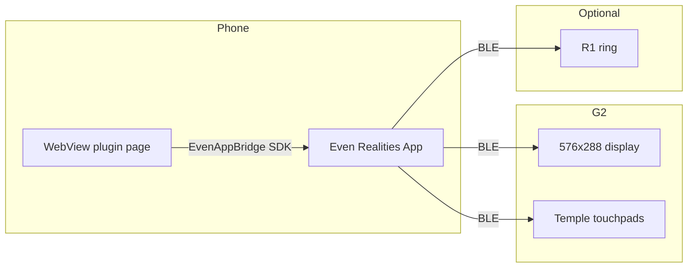

# Architecture

Verified from official Even Hub documentation and installed `@evenrealities/even_hub_sdk` types.

## Runtime model

- Your code runs in a **WebView** inside the Even Realities phone app.
- The **G2** renders containers you create via the SDK (`createStartUpPageContainer`, `rebuildPageContainer`).
- **Input** (tap, double-tap, scroll) arrives as `EvenHubEvent` callbacks on the bridge.
- The **R1 ring** uses the same gesture set; source is `EventSourceType.TOUCH_EVENT_FROM_RING` on `sysEvent`.

## Boundaries in this repo

| Layer             | Path          | Responsibility                                  |
| ----------------- | ------------- | ----------------------------------------------- |
| SDK integration   | `src/even/`   | Bridge init, render, events, lifecycle, cleanup |
| Application logic | `src/app/`    | Pure state reduction; no SDK imports            |
| Debug UI          | `src/ui/`     | Phone browser development surface               |
| Hermes (future)   | `src/hermes/` | HTTP transport to self-hosted Hermes            |

## Event flow

1. User gesture on G2 or R1 → phone app → SDK → `bridge.onEvenHubEvent`
2. `src/even/events.ts` maps raw `EvenHubEvent` → domain events
3. `src/app/state.ts` reduces domain events → `AppState`
4. `src/even/session.ts` calls `rebuildPageContainer` to update glasses text
5. `src/ui/debug-panel.ts` mirrors state on the phone screen

## Rendering flow

1. `waitForEvenAppBridge()` → `EvenAppBridge` singleton
2. `createStartUpPageContainer` with `TextContainerProperty` (`isEventCapture: 1`)
3. On input, `rebuildPageContainer` with updated content
4. Double-tap → `shutDownPageContainer(1)`

## Networking and distribution (forward-looking)

Phase A has no backend. Future Hermes integration:

- Glasses app remains a **dumb client**; Hermes owns session/memory/vault routing via `POST /ask`.
- `baseUrl` + auth token configured on the **phone WebView** (settings UI), persisted via SDK `localStorage`.
- Personal use: Tailscale tailnet + HTTPS on `.ts.net` hostname; verify WebView reachability on device.
- Distribution: QR sideload (personal) → private build → public `.ehpk` submission.

## Sources

- [Even Hub overview](https://hub.evenrealities.com/docs/get-started/overview)
- [Official minimal template](https://github.com/even-realities/evenhub-templates/tree/main/minimal)
- Installed SDK: `node_modules/@evenrealities/even_hub_sdk/dist/index.d.ts`
